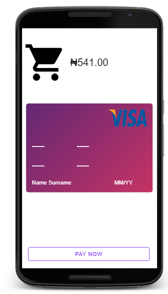
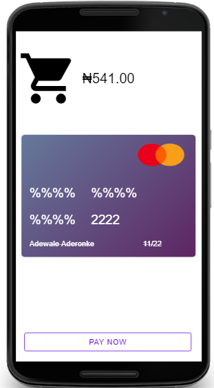

<pre>
# Facecard-App
An Andela/Facebook Assessment for a Facebook Developer Program

It is a MobileCard App that accepts cards payment for items purchased

The development is strictly through ES6, CSS3 and HTML5

It validate the Card Holder's Name, Card's expiry date and Card type before allowing payment.
[]
[]
</pre>

